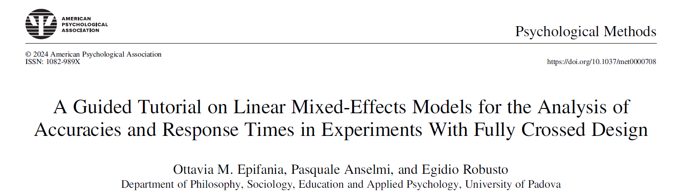

```{r setup, include=FALSE}
hook_output <- knitr::knit_hooks$get("output")

knitr::knit_hooks$set(output = function(x, options) {
 if (!is.null(n <- options$out.lines)) {
 x <- xfun::split_lines(x)
 if (length(x) > n) {
 # truncate the output
 x <- c(head(x, n), "....\n")
 }
 x <- paste(x, collapse = "\n")
 }
 hook_output(x, options)
 })
library(ggplot2)
library(lme4)
```

### 

\centering
How it started: 

\vspace{2mm}

> A random lesson by Professor Pastore on Generalized Linear Mixed Effects Models


. . . 

\centering

How it ended: 

\vspace{2mm}


```{r}
#| out-width: 80%

```

[https://doi.org/10.1037/met0000708](https://doi.org/10.1037/met0000708)


# Fully-crossed structures

## An example: The SNARC effect

### 

\centering

```{=latex}
\scalebox{.60}{
\begin{tikzpicture}[scale=1.2, thick]

  % Asse con frecce alle estremità
  \draw[->] (-5.5,0) -- (5.5,0);

  % Etichette dei valori selezionati
  \foreach \x in {-5,-3,-1,0,1,3,5}
    \draw (\x,0) node[circle,draw,minimum size=0.8cm,inner sep=0pt, yshift=-1.5cm] {\x};

  % Etichette testo
  \node at (-6,0) {$-\infty$};
  \node at (6,0) {$+\infty$};


  % Optional: linee guida verticali
  % \foreach \x in {-5,-3,-1,0,1,3,5}
  %   \draw[dashed,gray] (\x,0.5) -- (\x,-0.5);

\end{tikzpicture}
}

```


:::: {.columns}

::: {.column with="50%"}
\centering

Small numbers: 

Perceived on the \color{latenti}left
:::

::: {.column with="50%"}
\centering

Large numbers: 

Perceived on the \color{manifeste}right
:::

::::


### 

:::: {.columns}

::: {.column width="50%"}

\begin{center}
A \emph{sample} of small numbers:

$1, 2, 3, 4$
\end{center}
:::

::: {.column width="50%"}
\begin{center}
A \emph{sample} of large numbers:

$6, 7, 8, 9$
\end{center}
:::
:::

Two conditions:

\centering

The "natural" one (so-called *compatible* condition)

```{=latex}

\centering
\scalebox{.60}{
\begin{tikzpicture}[scale=1.2, thick]

  % Asse orizzontale
  \draw[->] (-1,0) -- (10,0) node[right] {};

  % Numeri sulla linea
  \foreach \x in {1,2,...,9}
    \draw (\x,0) circle (0.2) node[below=7pt] {\x};

  % Frecce per SNARC effect
  % Numeri piccoli -> sinistra
  \foreach \x in {1,2,3,4}
    \draw[->, red] (\x,0.3) -- ++(-0.5,0.5);

  % Numeri grandi -> destra
  \foreach \x in {6,7,8,9}
    \draw[->, blue] (\x,0.3) -- ++(0.5,0.5);

  % Etichette
  \node[red] at (0.2,1.1) {Left response key};
  \node[blue] at (9.5,1.1) {Right response key};
\end{tikzpicture}
}
```

. . . 

The "innatural" one (so-called *incompatible* condition)

```{=latex}
\centering
\scalebox{.60}{
\begin{tikzpicture}[scale=1.2, thick]

  % Asse orizzontale
  \draw[->] (-1,0) -- (10,0) node[right] {};

  % Numeri sulla linea
  \foreach \x in {1,2,...,9}
    \draw (\x,0) circle (0.2) node[below=7pt] {\x};

  % Frecce per SNARC effect
  % Numeri piccoli -> sinistra
  \foreach \x in {1,2,3,4}
    \draw[->, blue] (\x,0.3) -- ++(-0.5,0.5);

  % Numeri grandi -> destra
  \foreach \x in {6,7,8,9}
    \draw[->, red] (\x,0.3) -- ++(0.5,0.5);

  % Etichette
  \node[blue] at (0.2,1.1) {Right response key};
  \node[red] at (9.5,1.1) {Left response key};

\end{tikzpicture}
}
```


###


\small

$t = \{1, 2, \ldots, T\}$: Number of trials (condition $\times$ stimulus $\times$ respondent)
\vspace{3mm}

\centering
\scalebox{.90}{
\begin{tabular}{ll cccccccc}
\hline
& &  \multicolumn{4}{c}{Small Numbers} & \multicolumn{4}{c}{Large Numbers} \\
& Condition & 1 & 2 & 3 & 4 & 6 & 7 & 8 & 9 \\
\hline
Jane & Compatible   & $y_{cj1}$ & $y_{cj2}$ & $y_{cj3}$ & $y_{cj4}$ & $y_{cj6}$ & $y_{cj7}$ & $y_{cj8}$ & $\sum_{t = 1}^{T} y_{cj}/T$ \\
& Incompatible & $y_{ij1}$ & $y_{ij2}$ & $y_{ij3}$ & $y_{ij4}$ & $y_{ij6}$ & $y_{ij7}$ & $y_{ij8}$ & $\sum_{t = 1}^{T} y_{ij}/T$ \\
\hline
Mario & Compatible   & $y_{cm1}$ & $y_{cm2}$ & $y_{cm3}$ & $y_{cm4}$ & $y_{cm6}$ & $y_{cm7}$ & $y_{cm8}$ & $\sum_{t = 1}^{T} y_{cm}/T$ \\
& Incompatible & $y_{im1}$ & $y_{im2}$ & $y_{im3}$ & $y_{im4}$ & $y_{im6}$ & $y_{im7}$ & $y_{im8}$ & $\sum_{t = 1}^{T} y_{im}/T$ \\
\hline
\end{tabular}
}


## Scoring


### Person-level scores


:::: {.columns}

::: {.column width="50%"}

$$s_p = \dfrac{\bar{X}_{p,\text{comp}} - \bar{X}_{p,\text{inc}}}{sd_{\text{pooled}}}$$

:::

. . . 

::: {.column width="50%"}

:::{.callout-tip}

## Advantages

Ease of computation

Ease of interpretation
:::

:::

::::

. . . 

::: {.callout-warning}


## (Implicit) Assumptions

1. Being slow (less accurate) in one condition $=$ being fast (or more accurate) in the opposite one: $0$ means absence of bias

2. All stimuli have the same impact (fixed effects)
:::

## The issue

### A long tradition 

::: {.callout-note}
## Respondents are random factors
		
Sampled from a larger population
	
Need for acknowledging the sampling variability 
		
Results can be generalized to other respondents belonging to the same population

:::

\vspace{3mm}
\pause

::: {.callout-note}

## Stimuli/items are fixed factors
	
Taken to be entire population 
	
There is no sampling variability

There is no need to generalize the results because the stimuli are the population
:::


### With long lasting consequences

- Generalization of the results is impaired

- Error variance everywhere, left free to bias everything

- The information at the stimulus level is lost 

\pause

:::: {.columns}

::: {.column width="50%"}

\Large

$$\Sigma$$

\normalsize

\centering
Linear Mixed Effects Models


:::

::: {.column width="50%"}
\Large

$$\psi$$

\normalsize
\centering

Rasch model
:::

::::


\pause

\centering
\includegraphics[width=.10\linewidth]{img/psicostat.jpg}

\large

Rasch-like parametrization estimated with Linear Mixed Effects Models

## When?

###


```{=latex}
\tikzstyle{respondent} = [rectangle, minimum width=1.5cm, minimum height=1cm,text centered, draw=white]
\tikzstyle{stimulus} = [rectangle, minimum width=1.5cm, minimum height=1cm,text centered, draw=white]
\tikzstyle{trial} = [rectangle, minimum width=1cm, minimum height=1cm,text centered, draw=black]
\tikzstyle{process} = [rectangle, rounded corners, minimum width=0.5cm, minimum height=1cm, text width =2.5cm, text centered, draw=black]
\tikzstyle{arrow} = [thick,->,>=stealth]
\tikzstyle{condition} = [rectangle, rounded corners,draw=black,text width=2cm, text height=6.5cm]

\centering
\scalebox{.30}{
	\begin{tikzpicture}[inner sep=1pt,auto=left, node distance=2cm,>=latex']
 				 
 				\node(s1) at(2, 16)  [respondent]  {$p_1$};
 				\node(s2) at (2, 11) [respondent] {$p_2$};
 				\node(s3) at (2, 5.5) [respondent] {$p_3$};
 				\node(t1) at (12, 17) [ trial] {};
 				\node(t2) at (12, 15.5) [trial] {};
 				\node(t3) at (12, 14) [trial] {};
 				\node(t4) at (12, 12.5) [trial] {};
 				\node(t5) at (12, 9) [trial] {};
 				\node(t6) at (12, 7.5) [trial] {};
 				\node(t7) at (12, 6) [trial] {};
 				\node(t8) at (12, 4.5) [trial] {};
 				\node(stim1) at(22, 13)  [stimulus]  {\Smiley[3]};
 				\node(stim2) at (22, 7) [stimulus] {\Sleepey[3]};
 				\node at (12, 14.8) [condition, dashed,ultra thick] {};  
 				\node at (12, 6.8) [condition, black,ultra thick] {};  
 				\draw [->, shorten >= +3pt] (s1.east) -- (t1.west);
 				\draw [->, shorten >= +3pt] (s2.east) -- (t1.west);
 				\draw [->, shorten >= +3pt] (s3.east) -- (t1.west);
 				\draw [->, shorten >= +3pt] (s1.east) -- (t2.west);
 				\draw [->, shorten >= +3pt] (s2.east) -- (t2.west);
 				\draw [->, shorten >= +3pt] (s3.east) -- (t2.west);
 				\draw [->, shorten >= +3pt] (s1.east) -- (t3.west);
 				\draw [->, shorten >= +3pt] (s2.east) -- (t3.west);
 				\draw [->, shorten >= +3pt] (s3.east) -- (t3.west);
 				\draw [->, shorten >= +3pt] (s1.east) -- (t4.west);
 				\draw [->, shorten >= +3pt] (s2.east) -- (t4.west);
 				\draw [->, shorten >= +3pt] (s3.east) -- (t4.west);
 				\draw [->, shorten >= +3pt] (s1.east) -- (t5.west);
 				\draw [->, shorten >= +3pt] (s2.east) -- (t5.west);
 				\draw [->, shorten >= +3pt] (s3.east) -- (t5.west);
 				\draw [->, shorten >= +3pt] (s1.east) -- (t6.west);
 				\draw [->, shorten >= +3pt] (s2.east) -- (t6.west);
 				\draw [->, shorten >= +3pt] (s3.east) -- (t6.west);
 				\draw [->, shorten >= +3pt] (s1.east) -- (t7.west);
 				\draw [->, shorten >= +3pt] (s2.east) -- (t7.west);
 				\draw [->, shorten >= +3pt] (s3.east) -- (t7.west);
 				\draw [->, shorten >= +3pt] (s1.east) -- (t8.west);
 				\draw [->, shorten >= +3pt] (s2.east) -- (t8.west);
 				\draw [->, shorten >= +3pt] (s3.east) -- (t8.west);
 				\draw [<-, shorten <= +3pt] (t1.east)  -- (stim1.west); 
 				\draw [<-, shorten <= +3pt] (t2.east)  -- (stim2.west); 
 	  			\draw [<-, shorten <= +3pt] (t3.east)  -- (stim1.west); 
 	 			\draw [<-, shorten <= +3pt] (t4.east)  -- (stim2.west); 
 	  			\draw [<-, shorten <= +3pt] (t5.east)  -- (stim1.west); 
 	 \draw [<-, shorten <= +3pt] (t6.east)  -- (stim2.west); 
 	  	\draw [<-, shorten <= +3pt] (t7.east)  -- (stim1.west); 
 	 \draw [<-, shorten <= +3pt] (t8.east)  -- (stim2.west); 
 			\end{tikzpicture}
}

```


:::: {.columns}

::: {.column width="50%"}
\centering

\textcolor{latenti}{Sample-level differences}:

Compatible and incompatible can be defined *a priori*

(SNARC effect)

:::

::: {.column width="50%"}

\centering

\textcolor{manifeste}{Individual differences}:

Compatible and incompatible are defined within each respondent

(Implicit Association Test)

:::

::::

# Un classico della Psicometria

### Il modello di Rasch


$$P(x_{ps} = 1|\theta_p, b_s) = \dfrac{\exp(\theta_p - b_z)}{1+ \exp(\theta_p - b_z)}$$
$\theta_p$: Latent trait of person $p$

$b_s$: "challenging" power of stimulus $s$


### A GLM for dichotmous responses

:::: {.columns}
::: {.column width="60%"}
\includegraphics[width=\linewidth]{img/linkGLM.pdf}
:::

::: {.column width="40%"}
\small
Logit link function $g$:

$$g(\eta_{ps}) = log\left(\frac{\mu_{ps}}{1 - \mu_{ps}}\right)$$


Inverse $g^{-1}$


$$g^{-1} = \frac{\exp(\eta_{ps})}{1 + \exp(\eta_{ps})}$$
:::
::::


## Rasch-like parametrization of response times

### The log-normal model

$$E(t_{ps}| \tau_p, \delta_s) = \delta_s - \tau_p + \varepsilon$$


$\tau_p$: the speed of person $p$

$\delta_s$: the time intensity of stimulus $s$


. . .

A linear  model with an identity function!


## In summary

### 

:::: {.columns}

:::{.column width="50%"}
::: {.callout-note}
## Rasch

\footnotesize

$P(x_{ps} = 1) = \dfrac{\exp(\theta_p - b_z)}{1+ \exp(\theta_p - b_z)}$
:::

::: {.callout-note}
## Log-normal

\footnotesize

$E(t_{ps}| \tau_p, \delta_s) = \delta_s - \tau_p + \varepsilon$
:::
:::

:::{.column width="50%"}
\footnotesize


::: {.callout-important}
## GLM (inverse function)
\footnotesize

$P(x_{ps} = 1) = \displaystyle \frac{\exp(\theta_p \, + \, b_s)}{1 + \exp(\theta_p \, + \, b_s)}$

:::

::: {.callout-important}
## LM (identity function)

$E(t_{ps}| \tau_p, \delta_s) = \delta_s + \tau_p + \varepsilon$
:::

:::

::::


# Random Factors and Effects

###

In a LM:

$$\eta = \mathbf{X}\beta$$

$\mathbf{X}$: Model Matrix

$\beta$: Coefficients

. . .


Needs to be extended:


$$\eta = \mathbf{X}\beta + \color{blu}Zd$$

\small

$d$: Random effects associated to the random factors in $Z$ $\ldots$ Not model parameters! *Best Linear Unbiased Predictors* 

$\Gamma$: Parameters estimated for the random factors in the model (variances and covariances)

## Random structures

### The maximal model

Address all the possible sources of random variability that can be expected

\pause

The models that are useful for ones aim

\pause
Common goal: Investigate the changes in the performance of the respondents between the associative conditions

\pause
Less common: Investigate the changes in the functioning of the stimuli between the associative conditions

### Preliminarities

| Index               | Meaning               | Variable       |
|---------------------|------------------------|----------------|
| $p = 1, \ldots, P$  | Respondent            | `respondents`  |
| $s = 1, \ldots, S$  | Stimulus              | `stimuli`      |
| $c \in \{0,1\}$     | Associative condition | `condition`    |
| $i$                | Trial                 |                |

:::: {.columns}

:::{.column width="50%"}
\centering

Accuracy:


GLMM

$y = [0,1]$

:::

:::{.column width="50%"}
\centering

Log-time response


LMM

$y = [0, + \infty)$ (log-transformed)

\vspace{3mm}

$\varepsilon \sim \mathcal{N}(0, \sigma^2)$
:::

::::

### Model 1

\footnotesize


::: {.callout-note}
## Mathematical Notation
$y = \beta_c X_c + \alpha_p[i] + \alpha_s[i]$
:::

::: {.callout-tip}
## `lme4` notation

```{r}
#| eval: false
#| echo: true

y ~ 0 + condition + (1|stimuli) + (1|respondents)
```

:::


::: {.callout-caution}
## Rasch-like parametrization
\vspace*{-5mm}
```{r}
library(knitr)
kable(
  data.frame(
    row.names = c("respondents", "stimuli"),
    GLMM = c("$\\theta_p$", "$b_s$"),
    LMM  = c("$\\tau_p$", "$\\delta_s$")
  ),
  escape = FALSE,
  col.names = c("GLMM", "LMM")
)
```

:::

### Model 2

\footnotesize


::: {.callout-note}
## Mathematical Notation
$y = \beta_c X_c + \alpha_p[i] + \beta_s[i]c_i$
:::

::: {.callout-tip}
## `lme4` notation

```{r}
#| eval: false
#| echo: true

y ~ 0 + condition + (0+condition|stimuli) + (1|respondents)
```

:::


::: {.callout-caution}
## Rasch-like parametrization
\vspace*{-5mm}
```{r}
library(knitr)
kable(
  data.frame(
    row.names = c("respondents", "stimuli"),
    GLMM = c("$\\theta_p$", "$b_{sc}$"),
    LMM  = c("$\\tau_p$", "$\\delta_{sc}$")
  ),
  escape = FALSE,
  col.names = c("GLMM", "LMM")
)
```

:::

### Model 3

\footnotesize


::: {.callout-note}
## Mathematical Notation
$y = \beta_c X_c + \beta_p[i]c_i + \alpha_s[i]$
:::

::: {.callout-tip}
## `lme4` notation

```{r}
#| eval: false
#| echo: true

y ~ 0 + condition + (1|stimuli) + (0+condition|respondents)
```

:::


::: {.callout-caution}
## Rasch-like parametrization
\vspace*{-5mm}
```{r}
library(knitr)
kable(
  data.frame(
    row.names = c("respondents", "stimuli"),
    GLMM = c("$\\theta_{pc}$", "$b_{s}$"),
    LMM  = c("$\\tau_{pc}$", "$\\delta_{s}$")
  ),
  escape = FALSE,
  col.names = c("GLMM", "LMM")
)
```

:::

### All models are wrong...

Find the useful model via model comparison: AIC and BIC

The lower the value, the better the model

:::{.callout-important}
## AIC, BIC, and model complexity:

Total number of parameters: $\beta$ and $\Gamma$

*NOT* the levels in $d$
:::

Model 2 and Model 3: Same complexity, different focus

The chosen model is the least wrong model *given the models considered*: Relativity applies everywhere

# Real data

### The Implicit Association Test
\begin{textblock*}{10cm}(0.5cm,1cm)
{\includegraphics[width=\linewidth]{cokeIAT1.png}}
\end{textblock*}
\begin{textblock*}{10cm}(0.7cm,1.4cm)
{\includegraphics<2->[width=\linewidth]{cokeIAT2.png}}
\end{textblock*}
\begin{textblock*}{10cm}(0.9cm,1.8cm)
{\includegraphics<3->[width=\linewidth]{cokeIAT3.png}}
\end{textblock*}
\begin{textblock*}{10cm}(1.1cm,2.2cm)
{\includegraphics<4->[width=\linewidth]{cokeIAT4.png}}
\end{textblock*}
\begin{textblock*}{10cm}(1.3cm,2.6cm)
{\includegraphics<5->[width=\linewidth]{cokeIAT5.png}}
\end{textblock*}
	
\vskip0pt plus 1filll
	
\onslide<2-2> Response key: E
\onslide<3-3> Response key: I
\onslide<4-4> Response key: I
\onslide<5-5> Response key: E

###

\small


\begin{block}{12 Object stimuli}
\begin{columns}
\column{.50\linewidth}
\centering
White people faces
\includegraphics[width=\linewidth]{img/white.png}
\column{.50\linewidth}
\centering
Black people faces
\includegraphics[width=\linewidth]{img/black.png}
\end{columns}
\end{block}

\begin{block}{16 Attribute stimuli}

\begin{columns}[T]
\begin{column}{.50\linewidth}
\begin{center}
\color{blue}Positive attributes
\end{center}
Good, laughter, pleasure, glory, peace, happy, joy, love
\end{column}

\begin{column}{.50\linewidth}
\begin{center}
\color{alert}Negative attributes
\end{center}

Evil, bad, horrible, terrible, nasty, pain, failure, hate
\end{column}
\end{columns}
\end{block}


### Get set

```{r}
#| echo: true
#| eval: false

# install package for fitting lmms
install.packages("lme4")
# nice plots :)
install.packages("ggplot2")


library(lme4) 
library(ggplot2) 
```


### The data

\small

```{r}
#| echo: true
data = read.csv("data/example-data.csv",
                header = TRUE, sep =",")
head(data)
```


###

Number of trials $\times$ condition $\times$ respondent:

```{r out.lines=8}
#| echo: true
table(data$respondent, data$condition)
```


## GLMMs for accuracy

###

\vspace*{-5mm}

\footnotesize

Model 1: $y_{i} = logit^{-1}(\alpha + \beta_c X_c  + \alpha_{p[i]} +  \alpha_{s[i]})$

\scriptsize
```{r}
#| echo: true
accuracy1 = glmer(accuracy ~ 0 + condition + (1|stimuli) + (1|respondent),
                  data = data,
                  family = "binomial")
```
\footnotesize
Model 2: $y_{i} = logit^{-1}(\alpha + \beta_c X_c  +\alpha_{p[i]} +  \beta_{s[i]}c_{i})$
\scriptsize
```{r}
#| echo: true
accuracy2 = glmer(accuracy ~ 0 + condition + (0 + condition|stimuli) +
                    (1|respondent),
                  data = data,
                  family = "binomial")
```

\footnotesize
Model 3: $y_{i} = logit^{-1}(\alpha + \beta_c X_c  + \alpha_{s[i]} +  \beta_{p[i]}c_{i})$
\scriptsize

```{r}
#| echo: true
accuracy3 = glmer(accuracy ~ 0 + condition + (1|stimuli) +
                    (0 + condition|respondent),
                  data = data,
                  family = "binomial")
```


## LMMs for log-time responses

###

\vspace*{-5mm}

\footnotesize

Model 1: $y_{i} = \alpha + \beta_c X_c  + \alpha_{p[i]} +  \alpha_{s[i]} + \varepsilon_i$

\scriptsize

```{r}
#| echo: true
logtime1 = lmer(log(latency) ~ 0 + condition + (1|stimuli) + (1|respondent),
                  data = data,
                  REML = FALSE)
```

\footnotesize
Model 2: $y_{i} = \alpha + \beta_c X_c  +\alpha_{p[i]} +  \beta_{s[i]}c_{i} + \varepsilon_i$
\scriptsize
```{r}
#| echo: true
logtime2 = lmer(log(latency) ~ 0 + condition + (0 + condition|stimuli) +
                    (1|respondent),
                  data = data,
                  REML = FALSE)
```

\footnotesize
Model 3: $y_{i} = \alpha + \beta_c X_c  + \alpha_{s[i]} +  \beta_{p[i]}c_{i} + \varepsilon_i$
\scriptsize
```{r}
#| echo: true
logtime3 = lmer(log(latency) ~ 0 + condition + (1|stimuli) +
                    (0 + condition|respondent),
                  data = data,
                  REML = FALSE)
```

## Model comparison

### GLMMs

\footnotesize
:::{.callout-warning}
## Important!

The use of the `anova()` function is just for the convenience of having all the information on the same page!
:::

\scriptsize
```{r}
#| echo: true

anova(accuracy1, accuracy2, accuracy3)
```

### LMMs

\footnotesize
:::{.callout-warning}
## Important!

The use of the `anova()` function is just for the convenience of having all the information on the same page!
:::

\scriptsize
```{r}
#| echo: true

anova(logtime1, logtime2, logtime3)
```

### Useful Models:

:::: {.columns}

:::{.column width="50%"}
\centering

GLMMs

*Model 2*

$\theta_p$

$b_{\text{WGBB}}$ and $b_{\text{BGWB}}$

\vspace{1.5mm}
\flushleft
\small

The IAT effect is mostly due to variations in the *stimuli functioning* between conditions, while the performance of the respondents seems unaltered
:::

:::{.column width="50%"}
\centering
LMMs

*Model 3*

$\tau_{\text{WGBB}}$ and $\tau_{\text{BGWB}}$

$\delta_s$

\vspace{1.5mm}
\flushleft
\small

The IAT effect is mostly due to variations in the *performance of the respondents* between conditions, while the functioning of the stimuli appears not affected
:::
::::


Results should be interpreted together!

## Rasch-like estimates

### $\theta_p$

:::: {.columns}

::: {.column width="50%"}

```{r}
parole <- c("annoying", "bf14", "bf23", "bf56", "bm14", "bm23", "bm56", "evil",
            "failure", "glory", "good", "happiness", "hate", "horrible", "joy",
            "laughter", "love", "pain", "peace", "pleasure", "terrible", "wf2",
            "wf3", "wf6", "wicked", "wm1", "wm4", "wm6")

# Categorie predefinite
negative <- c("annoying", "evil", "failure", "hate", "horrible", "pain", "terrible", "wicked")
positive <- c("glory", "good", "happiness", "joy", "laughter", "love", "peace", "pleasure")

# Funzione di categorizzazione
categorizza <- function(x) {
  if (x %in% negative) {
    return("negative")
  } else if (x %in% positive) {
    return("positive")
  } else if (grepl("^wf|^wm", x)) {
    return("wp")
  } else if (grepl("^bf|^bm", x)) {
    return("bp")
  } else {
    return("altro")  # per sicurezza
  }
}

# Applichiamo la funzione a tutte le parole
categorie <- sapply(parole, categorizza)

# Creiamo un data frame per vedere il risultato
cat = data.frame(stimuli = parole, category = categorie)
ab_iat =  as.data.frame(ranef(accuracy2,   # BLUP of the stimuli
                                        condVar = TRUE)) 
ab_iatSingles = ab_iat[ab_iat$grpvar %in% "respondent", c("grpvar", "condval", "condsd")]

ab_iat = data.frame(sbj = rownames(coef(accuracy2)$respondent),
                    theta = coef(accuracy2)$respondent[,1]) 
graph_theta_iat = ggplot(ab_iat, 
                         aes(x = theta)) + 
  geom_density() 
# the code from line 331 to line 339 results in the plot represented in Figure 10a in the manuscript
graph_theta_iat + # object containing the starting plot
  geom_density(fill = "springgreen4", # change the color of the filling of the density distribution
               alpha = .50) + 
  theme_light() + # define the theme of the plot
  theme(legend.position =  "none", # remove the legend
        axis.title.y = element_blank(), # remove the title of the y-axis
        axis.title.x = element_text(size = 30, face = "bold"), # increase the size of x-axis title and set it to bold
        axis.text = element_text(size = 26, face = "bold")) + # increase the size of x-axis text and set it to bold
  xlab(expression(theta))
```

:::

::: {.column width="50%"}

```{r}
ab_iatSingles$grpvar = paste(ab_iatSingles$grpvar, 1:nrow(ab_iatSingles), sep = "_")
ggplot(ab_iatSingles, 
       aes(y = reorder(grpvar, condval), 
           x = condval, color = grpvar)) + geom_point() + 
  ylab("Respondents")  +theme_light() + 
  theme(legend.position =  "none",
        axis.text.y = element_blank(),
        axis.title = element_text(size = 24), 
        axis.text.x = element_text(size = 22)) +  geom_errorbarh(aes(xmin = condval - 1.96*condsd, xmax= condval + 1.96*condsd)) +
  xlab(expression(theta)) + scale_fill_manual(values = rainbow(65))
```
:::

::::

### $b_{\text{WGBB}}$ and  $b_{\text{WGBB}}$


```{r}
#| out-width: 70%
#| fig-align: center
blup_easiness_iat = as.data.frame(ranef(accuracy2,   
                                        condVar = TRUE)) 
fixef_accuracy_iat = data.frame(term = names(fixef(accuracy2)), 
                      est = (fixef(accuracy2))) # assign the 
easiness_iat = merge(blup_easiness_iat, fixef_accuracy_iat)
# change the column names ----
colnames(easiness_iat) = c("Condition", "grpvar", "stimuli",
                   "blup", "se", "fix.est")
easiness_iat$stimuli = as.character(easiness_iat$stimuli)
easiness_iat$b = with(easiness_iat, fix.est + blup)
easiness_iat$categoria <- sapply(easiness_iat$stimuli, categorizza)

# Ordina per categoria
cat_levels <- c("negative", "positive", "bp", "wp")
easiness_iat$categoria <- factor(easiness_iat$categoria, levels = cat_levels)
easiness_iat <- easiness_iat[order(easiness_iat$categoria, easiness_iat$stimuli), ]

# Stimuli come fattore ordinato
easiness_iat$stimuli <- factor(easiness_iat$stimuli, levels = unique(easiness_iat$stimuli))
graph_b_ci = ggplot(easiness_iat, # dataset with the easiness estimates
                    aes(x = b, # easiness estimates on the x-axis
                        y = stimuli, # labels of the stimuli on the y axis
                        color = Condition)) + # change the color according to the condition
  geom_point() + # draw points to represent the easiness of each stimulus
  geom_errorbarh(aes(xmin = b - 1.96*se, # draw the error bars to represent the confidence intervals  (CI)
                     xmax= b + 1.96*se)) 

ggplot(easiness_iat, 
       aes(x = b,fill = Condition)) + geom_density(alpha =.50) + 
  xlim(-1, 4) + 
  scale_fill_manual(values = c("royalblue4", "gold"), 
                    labels = c("WBBG", "WGBB")) + 
  theme_light() + 
  theme(legend.position = "inside",
        legend.position.inside = c(.2, .6),
        legend.title = element_blank(),
        axis.title.x = element_text(size = 24), 
        axis.title.y = element_blank(), 
        axis.text = element_text(size = 24), 
        legend.text = element_text(size = 24))

```

### 

```{r}
#| fig-align: center

graph_b_ci +  # object containing the starting plot
  geom_point(size = 2) + # increase the size of the points
  geom_errorbarh(aes(xmin = b - 1.96*se, xmax= b + 1.96*se), 
                 linewidth=.95) + 
  theme_light() +  
  theme(legend.position = "none", 
        axis.title.x = element_text(size = 24), 
        axis.title.y = element_blank(), 
        axis.text = element_text(size = 18, color=c(rep("darkgreen", 8), rep("firebrick4", 8),
                                         rep("tan3", 6), 
                                        rep("aquamarine3", 6) ))) + 
  scale_color_manual(values = c("royalblue4", "gold"), 
                    labels = c("WBBG", "WGBB")) 

```

## Log-normal estimates

### $\tau_{\text{WGBB}}$ and $\tau_{\text{BGWB}}$

```{r}
#| out-width: 70%
#| fig-align: center
speed = as.data.frame(ranef(logtime3), condvar= TRUE)
fixef_speed = data.frame(term = names(fixef(logtime3)), # assign the labels of the conditions to the term column
                      est = (fixef(logtime3))) # assign the estimates of the fixed effects to the est column
# merge together the fixed effects and stimuli BLUP with their variances
speed = merge(speed, fixef_speed)
speed$tau = speed$condval + speed$est

ggplot(speed, 
       (aes(x = tau, fill  = term))) + geom_density(alpha = .5)  + 
  theme_light()+
  scale_fill_manual(values = c("royalblue4", "gold"), 
                    labels = c("WBBG", "WGBB")) + 
  xlab(expression(tau)) +theme(legend.position = "inside",
        legend.position.inside = c(.8, .8),
        legend.title = element_blank(),
        axis.title.x = element_text(size = 24), 
        axis.title.y = element_blank(), 
        axis.text = element_text(size = 24), 
        legend.text = element_text(size = 24))

```


### 

```{r}
#| out-width: 80%
#| fig-align: center
ggplot(speed, 
       (aes(x = tau, y = grp, color  = term))) + geom_point()  + 
  theme_light()+
  scale_color_manual(values = c("royalblue4", "gold"), 
                    labels = c("WBBG", "WGBB")) + 
  xlab(expression(tau)) +theme(legend.position = "inside",
        legend.position.inside = c(.8, .18),
        legend.title = element_blank(),
        axis.title.x = element_text(size = 24), 
        axis.title.y = element_blank(), 
        axis.text.x = element_text(size = 24), 
        axis.text.y = element_blank(),
        legend.text = element_text(size = 24)) + 
  geom_errorbar(aes(xmin = tau - 1.96*condsd, xmax = tau + 1.96*condsd), linewidth=.95)

```

### $\delta_s$

:::: {.columns}

::: {.column width="50%"}

```{r}
intensity = as.data.frame(ranef(logtime3), condvar = TRUE)
intensity = intensity[intensity$grpvar %in% "stimuli", ]
colnames(intensity)[3] = "stimuli"
intensity$categoria <- sapply(intensity$stimuli, categorizza)
cat_levels <- c("negative", "positive", "bp", "wp")
intensity$categoria <- factor(intensity$categoria, levels = cat_levels)
intensity <- intensity[order(intensity$categoria, intensity$stimuli), ]

# Stimuli come fattore ordinato
intensity$stimuli <- factor(intensity$stimuli, levels = unique(intensity$stimuli))

ggplot(intensity, 
       aes(x = condval)) + geom_density(fill = "orchid", alpha =.5) + xlim(-.35, .35) + theme_light() + 
  theme_light() + # define the theme of the plot
  theme(legend.position =  "none", # remove the legend
        axis.title.y = element_blank(), # remove the title of the y-axis
        axis.title.x = element_text(size = 30, face = "bold"), # increase the size of x-axis title and set it to bold
        axis.text = element_text(size = 26, face = "bold")) + # increase the size of x-axis text and set it to bold
  xlab(expression(delta))
```

:::

::: {.column width="50%"}

```{r}


ggplot(intensity, 
       aes(x = condval, y = stimuli, col = categoria)) + geom_point() + # increase the size of the points
  geom_errorbarh(aes(xmin = condval - 1.96*condsd, 
                     xmax= condval + 1.96*condsd)) + 
  theme_light() +  scale_color_manual(values = c("darkgreen", "firebrick4", "tan3", "aquamarine3")) + xlab(expression(delta)) + 
  theme(legend.position = "none", 
        axis.title.x = element_text(size = 24), 
        axis.title.y = element_blank(), 
        axis.text.x = element_blank(),
        axis.text.y = element_text(size = 18, color=c(rep("darkgreen", 8), rep("firebrick4", 8),
                                         rep("tan3", 6), 
                                        rep("aquamarine3", 6) ))) 
```
:::
::::

# The end 

### 

- The best model depends on the other models... sometimes useful, never right 

- The sky is the limit... but do not over complicate things 

\pause

\centering 
HOWEVER

\flushleft

- Time and accuracy are independent from one another, pretty bold assumption


